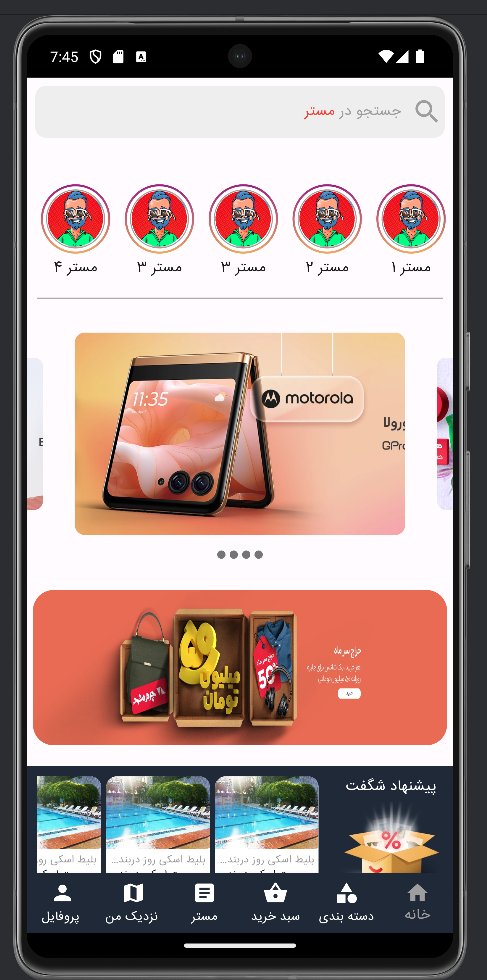
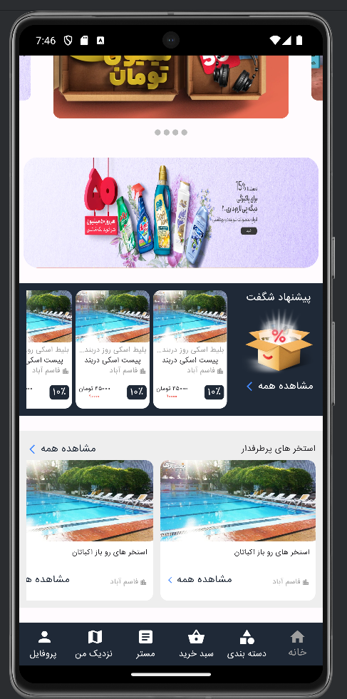
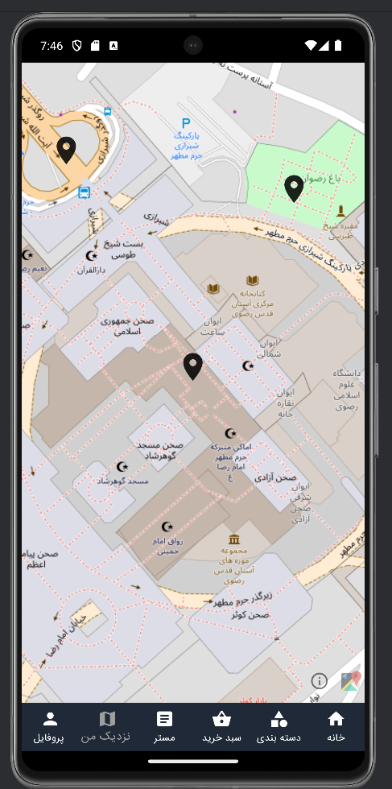
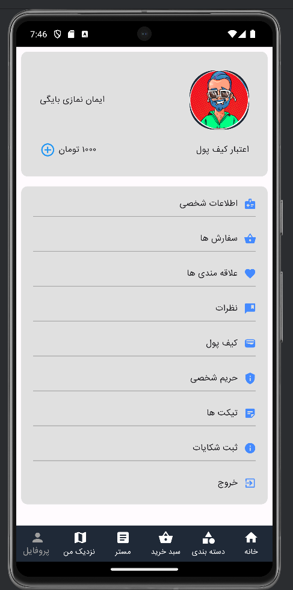

# 📱 Mester03 - Flutter Mobile App

**Mester03** is the **mobile application** of the Mester project.  
It provides users with access to exclusive deals, services, and tickets directly from their smartphones with a clean, fast, and responsive interface.  
The app integrates interactive maps, carousels, and localization support for a modern user experience.

---

## 🚀 Features
- 🌍 **Multi-language support** with `intl` & `flutter_localizations`
- 🖼️ **Image carousel & banners** using `carousel_slider`
- 🗺️ **Map integration** with `flutter_map`, `latlong2`, and `location`
- 📍 **Marker popups & location-based offers**
- 🖌️ **Custom UI components** (dotted borders, SVG icons)
- 🎨 **Custom fonts** (IranSans integrated)
- ⚡ State management with `get` package
- 📱 Optimized for both Android & iOS

---

## 🛠️ Tech Stack
- **Framework:** [Flutter](https://flutter.dev/) (Dart SDK 3.2.4+)
- **UI & Styling:** Material Design, IranSans font
- **State Management:** GetX (`get`)
- **Maps & Location:** flutter_map, flutter_map_marker_popup, latlong2, location
- **Media & Assets:** flutter_svg, carousel_slider, custom assets

---

## 📂 Project Structure (simplified)

mester03/
├─ assets/
│ ├─ fonts/ # Custom fonts (IranSans)
│ ├─ images/ # Image assets (logos, banners, etc.)
├─ lib/
│ ├─ main.dart # App entry point
│ ├─ pages/ # App screens
│ ├─ controllers/ # GetX controllers
│ └─ widgets/ # Reusable components
├─ pubspec.yaml
└─ README.md


---

## 📸 Screenshots

> ⚠️ Place your screenshots inside `/screenshots/` folder and update paths.

1. **Home Page**
   
   

2. **Map Integration**
   

3. **Profile**
   


---

## ⚙️ Getting Started

### Prerequisites
- [Flutter SDK](https://docs.flutter.dev/get-started/install) (>=3.2.4 <4.0.0)
- Android Studio / VSCode with Flutter & Dart extensions
- Emulator or real device (Android/iOS)

### Installation
Clone the repository:
```bash
git clone https://github.com/imandev989/mester03.git
cd mester03
flutter pub get
flutter run
flutter build apk --release
flutter build ios --release
```
